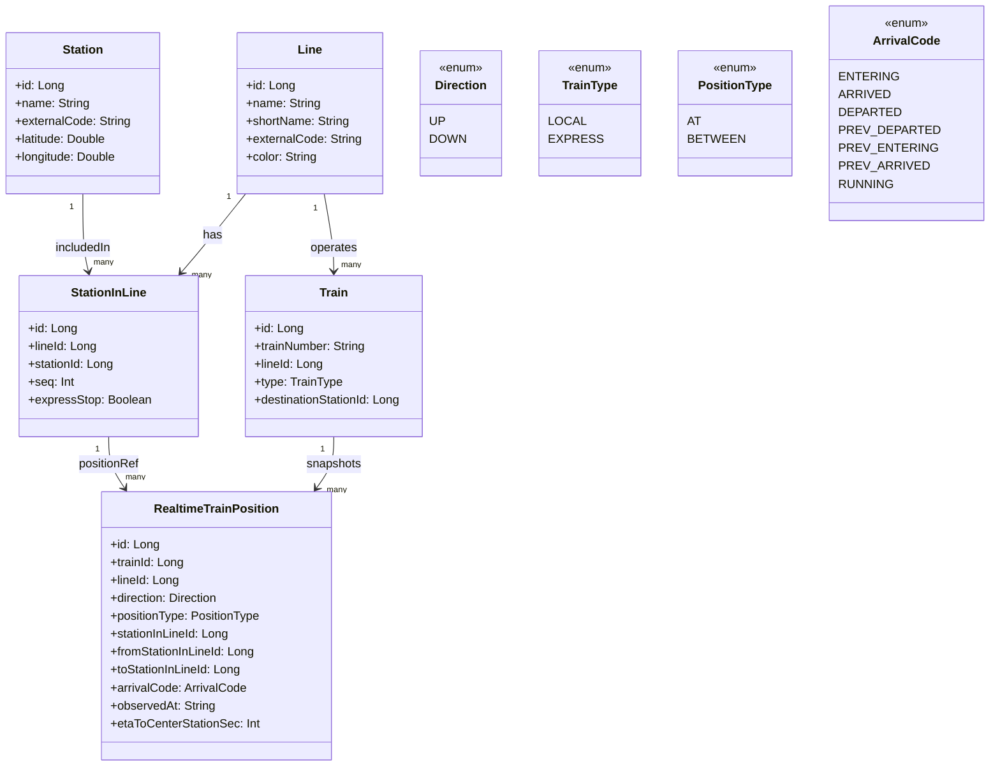

# Development Specifications
    kotlin: 1.9.25
    Springboot: 3.5.4
    Gradle: 8.14.3

# Coding Conventions
## Naming Conventions
### General Guidelines
- 모든 클래스명, 함수명, 변수명 등은 일관성을 유지해야 하며, 그 역할과 목적을 명확히 나타내야 한다.
- 약어 및 줄임말은 지양하며 가능하면 풀네임을 사용하도록 한다.
- 가능한 단어의 조합으로 의미를 전달하며, 혼동될 수 있는 이름은 지양한다.
### Package Naming
- 모두 소문자를 사용하도록 한다.
- 여러 단어로 이루어진 경우에도 구분자를 사용하지 않도록 한다.
### Class Naming
- 파스칼 표기법(PascalCase)을 사용하도록 한다.
### Function Naming
- 카멜 표기법(CamelCase)을 사용하도록 한다.
### Constant Naming
- 모두 대문자를 사용하도록 한다.
- 여러 단어로 이루어진 경우에는 "_"로 구분하도록 한다.
### Variable Naming
- 카멜 표기법(CamelCase)을 사용하도록 한다.
- 다음과 같은 데이터 타입 작성 규칙을 따르도록 한다.
    - Boolean: is, has, can, shows, contains 등 상태를 명확하게 나타내는 접두사를 붙이도록 한다.
        - 참고 링크: https://soojin.ro/blog/naming-boolean-variables
    - List: 단어의 복수형을 사용하도록 한다.
    - Map: 접미사로 "Map"을 붙이도록 한다.
    - Array: 접미사로 "Arr"을 붙이도록 한다.
    - Set: 접미사로 "Set"을 붙이도록 한다.

### API LIST
- 호선 별 역 정보 데이터 API
https://data.seoul.go.kr/dataList/OA-15442/S/1/datasetView.do

# Degine

