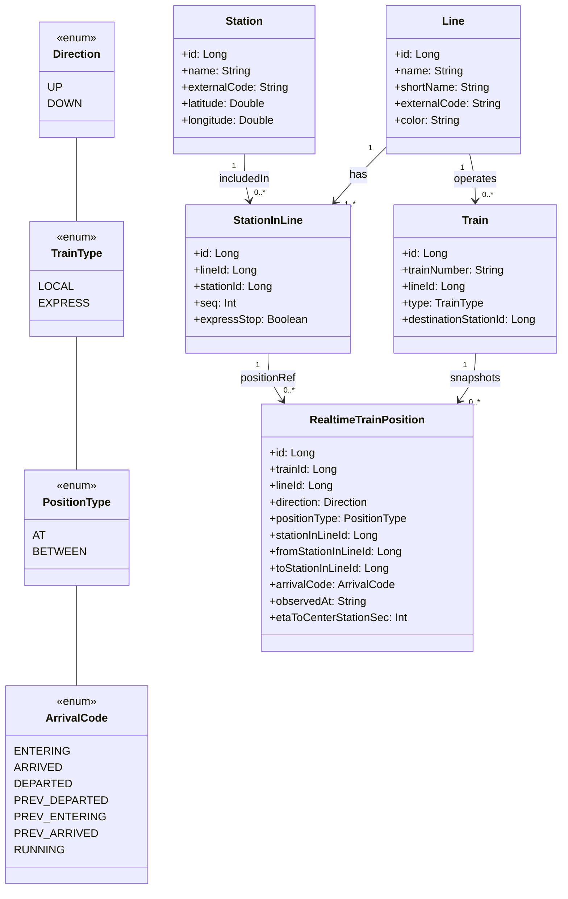
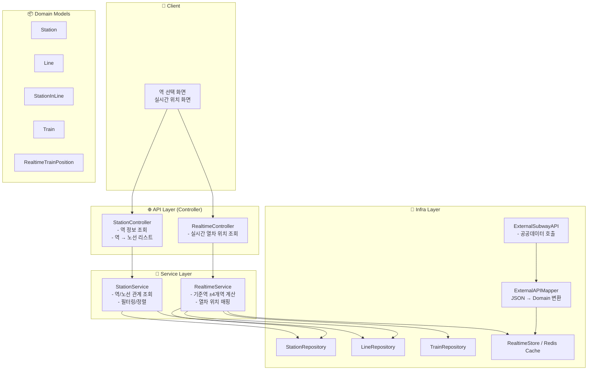

# Development Specifications
    kotlin: 1.9.25
    Springboot: 3.5.4
    Gradle: 8.14.3

# Coding Conventions
## Naming Conventions
### General Guidelines
- 모든 클래스명, 함수명, 변수명 등은 일관성을 유지해야 하며, 그 역할과 목적을 명확히 나타내야 한다.
- 약어 및 줄임말은 지양하며 가능하면 풀네임을 사용하도록 한다.
- 가능한 단어의 조합으로 의미를 전달하며, 혼동될 수 있는 이름은 지양한다.
### Package Naming
- 모두 소문자를 사용하도록 한다.
- 여러 단어로 이루어진 경우에도 구분자를 사용하지 않도록 한다.
### Class Naming
- 파스칼 표기법(PascalCase)을 사용하도록 한다.
### Function Naming
- 카멜 표기법(CamelCase)을 사용하도록 한다.
### Constant Naming
- 모두 대문자를 사용하도록 한다.
- 여러 단어로 이루어진 경우에는 "_"로 구분하도록 한다.
### Variable Naming
- 카멜 표기법(CamelCase)을 사용하도록 한다.
- 다음과 같은 데이터 타입 작성 규칙을 따르도록 한다.
    - Boolean: is, has, can, shows, contains 등 상태를 명확하게 나타내는 접두사를 붙이도록 한다.
        - 참고 링크: https://soojin.ro/blog/naming-boolean-variables
    - List: 단어의 복수형을 사용하도록 한다.
    - Map: 접미사로 "Map"을 붙이도록 한다.
    - Array: 접미사로 "Arr"을 붙이도록 한다.
    - Set: 접미사로 "Set"을 붙이도록 한다.

### API LIST
- 호선 별 역 정보 데이터 API
https://data.seoul.go.kr/dataList/OA-15442/S/1/datasetView.do

# Degine
📝 2. Domain Description (정식 문서)

📘 Direction (enum)
    - 열차의 이동 방향
    - UP: 상행
    - DOWN: 하행

📘 TrainType (enum)
    - 열차 종류
    - LOCAL: 일반
    - EXPRESS: 급행

📘 PositionType (enum)
    열차의 현재 위치 타입
    - AT: 특정 역 위
    - BETWEEN: 역과 역 사이 이동중

📘 ArrivalCode (enum)
    - 공공데이터 API의 0~5, 99 코드 매핑
    - ENTERING: 진입
    - ARRIVED: 도착
    - DEPARTED: 출발
    - PREV_*: 전역 기준 상태
    - RUNNING: 운행중
    
📘 Station
- 지하철 역 정보를 표현
  필드	             역할
  id	             내부 시스템 고유 PK
  name	             역 이름
  externalCode	     공공 API 역 코드
  latitude/longitude 지도 좌표(지금 은 미사용 지도 관련 기능 할 떄)

📘 Line
- 지하철 노선 정보
필드	         역할
shortName	 정렬/표시용 이름
color	     노선 색상
externalCode 공공 API 노선 코드

📘 StationInLine
- “노선 위의 역 + 순서”를 표현하는 핵심 도메인
필드	         역할
lineId	    어떤 노선인지
stationId	어떤 역인지
seq    	    노선 내 순서
expressStop	급행 정차 여부

📘 Train
- 단일 열차(편성) 정보
필드                     역할
trainNumber	            운영사 제공 열차 번호
type	                일반/급행
destinationStationId	종점

📘 RealtimeTrainPosition
- 실시간 열차 위치 정보
필드	                        역할
direction	                상행/하행
positionType	            AT/BETWEEN
stationInLineId	            역 위 위치
from / to StationInLineId	구간 위치
arrivalCode	                진입/도착/출발 상태
observedAt	                관측 시각

